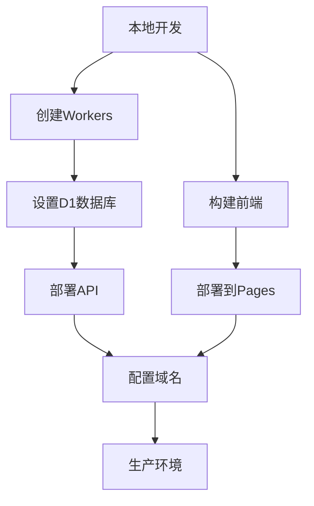

# Cloudflare部署指南

本文档详细说明如何将家庭任务管理系统部署到Cloudflare平台，包括前端、后端API和数据库的完整部署流程。

## 1. 部署架构概览

### 1.1 部署组件
- **前端**: Cloudflare Pages (React应用)
- **后端API**: Cloudflare Workers (Hono框架)
- **数据库**: Cloudflare D1 (SQLite)
- **缓存**: Cloudflare KV
- **认证**: JWT令牌

### 1.2 部署流程图


## 2. 前端部署 (Cloudflare Pages)

### 2.1 准备工作

1. **安装Wrangler CLI**
```bash
npm install -g wrangler
# 或使用pnpm
pnpm add -g wrangler
```

2. **登录Cloudflare**
```bash
wrangler login
```

### 2.2 配置构建设置

1. **修改package.json**
```json
{
  "scripts": {
    "build": "vite build",
    "preview": "vite preview",
    "deploy:pages": "wrangler pages deploy dist"
  }
}
```

2. **创建Pages配置文件**
创建 `wrangler.toml` (Pages部分):
```toml
name = "home-list-frontend"
compatibility_date = "2024-01-01"

[env.production]
route = "your-domain.com/*"
```

### 2.3 部署步骤

1. **构建项目**
```bash
pnpm run build
```

2. **首次部署**
```bash
wrangler pages create home-list
wrangler pages deploy dist --project-name=home-list
```

3. **后续部署**
```bash
pnpm run build
wrangler pages deploy dist
```

## 3. 后端API部署 (Cloudflare Workers)

### 3.1 创建Workers项目结构

```
workers/
├── src/
│   ├── index.ts          # 主入口文件
│   ├── routes/           # 路由定义
│   │   ├── auth.ts       # 认证路由
│   │   ├── tasks.ts      # 任务路由
│   │   └── family.ts     # 家庭管理路由
│   ├── middleware/       # 中间件
│   │   ├── auth.ts       # JWT认证中间件
│   │   └── cors.ts       # CORS中间件
│   ├── models/           # 数据模型
│   │   ├── user.ts
│   │   ├── task.ts
│   │   └── family.ts
│   └── utils/            # 工具函数
│       ├── jwt.ts
│       ├── password.ts
│       └── validation.ts
├── wrangler.toml         # Workers配置
└── package.json
```

### 3.2 Workers配置文件

创建 `workers/wrangler.toml`:
```toml
name = "home-list-api"
main = "src/index.ts"
compatibility_date = "2024-01-01"

# D1数据库绑定
[[d1_databases]]
binding = "DB"
database_name = "home-list-db"
database_id = "your-database-id"

# KV存储绑定
[[kv_namespaces]]
binding = "CACHE"
id = "your-kv-namespace-id"

# 环境变量
[vars]
JWT_SECRET = "your-jwt-secret"
ENVIRONMENT = "production"

[env.production]
route = "api.your-domain.com/*"
```

### 3.3 主要代码文件

**src/index.ts**
```typescript
import { Hono } from 'hono'
import { cors } from 'hono/cors'
import { authRoutes } from './routes/auth'
import { taskRoutes } from './routes/tasks'
import { familyRoutes } from './routes/family'

type Bindings = {
  DB: D1Database
  CACHE: KVNamespace
  JWT_SECRET: string
}

const app = new Hono<{ Bindings: Bindings }>()

// CORS中间件
app.use('*', cors({
  origin: ['https://your-domain.com', 'http://localhost:5173'],
  allowMethods: ['GET', 'POST', 'PUT', 'DELETE', 'OPTIONS'],
  allowHeaders: ['Content-Type', 'Authorization'],
}))

// 路由
app.route('/api/auth', authRoutes)
app.route('/api/tasks', taskRoutes)
app.route('/api/family', familyRoutes)

// 健康检查
app.get('/health', (c) => {
  return c.json({ status: 'ok', timestamp: new Date().toISOString() })
})

export default app
```

### 3.4 部署Workers

```bash
cd workers
npm install hono
wrangler deploy
```

## 4. 数据库设置 (Cloudflare D1)

### 4.1 创建D1数据库

```bash
# 创建数据库
wrangler d1 create home-list-db

# 记录返回的database_id，更新到wrangler.toml中
```

### 4.2 数据库初始化

1. **创建数据库架构文件**
创建 `workers/schema.sql`:
```sql
-- 用户表
CREATE TABLE users (
    id TEXT PRIMARY KEY DEFAULT (lower(hex(randomblob(16)))),
    email TEXT UNIQUE NOT NULL,
    password_hash TEXT NOT NULL,
    name TEXT NOT NULL,
    family_id TEXT,
    role TEXT DEFAULT 'member' CHECK (role IN ('admin', 'member')),
    created_at DATETIME DEFAULT CURRENT_TIMESTAMP,
    updated_at DATETIME DEFAULT CURRENT_TIMESTAMP,
    FOREIGN KEY (family_id) REFERENCES families(id)
);

-- 家庭表
CREATE TABLE families (
    id TEXT PRIMARY KEY DEFAULT (lower(hex(randomblob(16)))),
    name TEXT NOT NULL,
    description TEXT,
    admin_id TEXT NOT NULL,
    created_at DATETIME DEFAULT CURRENT_TIMESTAMP,
    updated_at DATETIME DEFAULT CURRENT_TIMESTAMP,
    FOREIGN KEY (admin_id) REFERENCES users(id)
);

-- 任务表
CREATE TABLE tasks (
    id TEXT PRIMARY KEY DEFAULT (lower(hex(randomblob(16)))),
    title TEXT NOT NULL,
    description TEXT,
    status TEXT DEFAULT 'pending' CHECK (status IN ('pending', 'in_progress', 'completed')),
    priority TEXT DEFAULT 'medium' CHECK (priority IN ('high', 'medium', 'low')),
    type TEXT DEFAULT 'regular' CHECK (type IN ('regular', 'long_term', 'recurring')),
    creator_id TEXT NOT NULL,
    assignee_id TEXT NOT NULL,
    completer_id TEXT,
    family_id TEXT NOT NULL,
    due_date DATETIME,
    recurring_rule TEXT, -- JSON格式存储重复规则
    created_at DATETIME DEFAULT CURRENT_TIMESTAMP,
    completed_at DATETIME,
    updated_at DATETIME DEFAULT CURRENT_TIMESTAMP,
    FOREIGN KEY (creator_id) REFERENCES users(id),
    FOREIGN KEY (assignee_id) REFERENCES users(id),
    FOREIGN KEY (completer_id) REFERENCES users(id),
    FOREIGN KEY (family_id) REFERENCES families(id)
);

-- 邀请码表
CREATE TABLE invite_codes (
    code TEXT PRIMARY KEY,
    family_id TEXT NOT NULL,
    expires_at DATETIME NOT NULL,
    created_at DATETIME DEFAULT CURRENT_TIMESTAMP,
    FOREIGN KEY (family_id) REFERENCES families(id)
);

-- 创建索引
CREATE INDEX idx_users_email ON users(email);
CREATE INDEX idx_users_family_id ON users(family_id);
CREATE INDEX idx_tasks_family_id ON tasks(family_id);
CREATE INDEX idx_tasks_assignee_id ON tasks(assignee_id);
CREATE INDEX idx_tasks_status ON tasks(status);
CREATE INDEX idx_tasks_created_at ON tasks(created_at DESC);
CREATE INDEX idx_invite_codes_expires_at ON invite_codes(expires_at);
```

2. **执行数据库初始化**
```bash
# 执行架构创建
wrangler d1 execute home-list-db --file=./schema.sql

# 验证表创建
wrangler d1 execute home-list-db --command=".tables"
```

### 4.3 数据迁移策略

#### 4.3.1 从localStorage迁移到D1

1. **创建迁移脚本**
创建 `src/utils/migration.ts`:
```typescript
export interface LocalStorageData {
  tasks: any[]
  familyMembers: any[]
  userData: any
}

export async function migrateFromLocalStorage(
  db: D1Database,
  localData: LocalStorageData
) {
  try {
    // 1. 创建家庭
    const familyId = generateId()
    await db.prepare(`
      INSERT INTO families (id, name, admin_id)
      VALUES (?, ?, ?)
    `).bind(familyId, '我的家庭', localData.userData.id).run()

    // 2. 迁移用户数据
    await db.prepare(`
      INSERT INTO users (id, email, name, family_id, role)
      VALUES (?, ?, ?, ?, ?)
    `).bind(
      localData.userData.id,
      localData.userData.email,
      localData.userData.name,
      familyId,
      'admin'
    ).run()

    // 3. 迁移任务数据
    for (const task of localData.tasks) {
      await db.prepare(`
        INSERT INTO tasks (
          id, title, description, status, priority, type,
          creator_id, assignee_id, family_id, due_date,
          recurring_rule, created_at
        ) VALUES (?, ?, ?, ?, ?, ?, ?, ?, ?, ?, ?, ?)
      `).bind(
        task.id,
        task.title,
        task.description,
        task.status,
        task.priority,
        task.type,
        task.creatorId,
        task.assigneeId,
        familyId,
        task.dueDate,
        JSON.stringify(task.recurringRule),
        task.createdAt
      ).run()
    }

    return { success: true, familyId }
  } catch (error) {
    console.error('Migration failed:', error)
    return { success: false, error: error.message }
  }
}
```

2. **添加迁移API端点**
在 `src/routes/migration.ts`:
```typescript
import { Hono } from 'hono'
import { migrateFromLocalStorage } from '../utils/migration'

const migration = new Hono<{ Bindings: Bindings }>()

migration.post('/migrate', async (c) => {
  const { localData } = await c.req.json()
  const result = await migrateFromLocalStorage(c.env.DB, localData)
  
  if (result.success) {
    return c.json({ success: true, familyId: result.familyId })
  } else {
    return c.json({ success: false, error: result.error }, 500)
  }
})

export { migration as migrationRoutes }
```

## 5. KV存储设置

### 5.1 创建KV命名空间

```bash
# 创建KV命名空间
wrangler kv:namespace create "CACHE"

# 记录返回的id，更新到wrangler.toml中
```

### 5.2 KV使用示例

```typescript
// 缓存用户会话
app.post('/api/auth/login', async (c) => {
  // ... 登录逻辑
  
  // 缓存用户信息
  await c.env.CACHE.put(
    `user:${user.id}`,
    JSON.stringify(user),
    { expirationTtl: 3600 } // 1小时过期
  )
  
  return c.json({ token, user })
})
```

## 6. 环境变量和配置

### 6.1 生产环境变量

```bash
# 设置生产环境变量
wrangler secret put JWT_SECRET
# 输入你的JWT密钥

wrangler secret put DATABASE_URL
# 如果需要外部数据库连接
```

### 6.2 前端环境配置

创建 `.env.production`:
```env
VITE_API_BASE_URL=https://api.your-domain.com
VITE_ENVIRONMENT=production
```

## 7. 域名配置

### 7.1 自定义域名设置

1. **Pages域名配置**
```bash
# 添加自定义域名到Pages
wrangler pages domain add your-domain.com
```

2. **Workers路由配置**
```bash
# 为API添加路由
wrangler route add "api.your-domain.com/*" home-list-api
```

### 7.2 DNS配置

在Cloudflare DNS中添加记录:
```
# A记录或CNAME记录
your-domain.com -> your-pages-url.pages.dev
api.your-domain.com -> your-worker.your-subdomain.workers.dev
```

## 8. 部署流程

### 8.1 完整部署脚本

创建 `deploy.sh`:
```bash
#!/bin/bash

echo "开始部署家庭任务管理系统到Cloudflare..."

# 1. 构建前端
echo "构建前端应用..."
pnpm run build

# 2. 部署前端到Pages
echo "部署前端到Cloudflare Pages..."
wrangler pages deploy dist

# 3. 部署Workers API
echo "部署API到Cloudflare Workers..."
cd workers
wrangler deploy
cd ..

echo "部署完成！"
echo "前端地址: https://your-domain.com"
echo "API地址: https://api.your-domain.com"
```

### 8.2 CI/CD配置 (GitHub Actions)

创建 `.github/workflows/deploy.yml`:
```yaml
name: Deploy to Cloudflare

on:
  push:
    branches: [main]

jobs:
  deploy:
    runs-on: ubuntu-latest
    steps:
      - uses: actions/checkout@v3
      
      - name: Setup Node.js
        uses: actions/setup-node@v3
        with:
          node-version: '18'
          
      - name: Install dependencies
        run: pnpm install
        
      - name: Build frontend
        run: pnpm run build
        
      - name: Deploy to Cloudflare Pages
        uses: cloudflare/pages-action@v1
        with:
          apiToken: ${{ secrets.CLOUDFLARE_API_TOKEN }}
          accountId: ${{ secrets.CLOUDFLARE_ACCOUNT_ID }}
          projectName: home-list
          directory: dist
          
      - name: Deploy Workers
        run: |
          cd workers
          npx wrangler deploy
        env:
          CLOUDFLARE_API_TOKEN: ${{ secrets.CLOUDFLARE_API_TOKEN }}
```

## 9. 监控和日志

### 9.1 Workers日志

```bash
# 查看实时日志
wrangler tail home-list-api

# 查看特定时间段的日志
wrangler tail home-list-api --since="2024-01-01T00:00:00Z"
```

### 9.2 性能监控

在Workers中添加性能监控:
```typescript
app.use('*', async (c, next) => {
  const start = Date.now()
  await next()
  const duration = Date.now() - start
  
  console.log(`${c.req.method} ${c.req.url} - ${duration}ms`)
})
```

## 10. 故障排除

### 10.1 常见问题

1. **CORS错误**
   - 检查Workers中的CORS配置
   - 确保前端域名在允许列表中

2. **数据库连接失败**
   - 验证D1数据库绑定配置
   - 检查wrangler.toml中的database_id

3. **JWT认证失败**
   - 确认JWT_SECRET环境变量设置
   - 检查token格式和过期时间

### 10.2 调试命令

```bash
# 本地开发模式
wrangler dev --local

# 测试D1数据库连接
wrangler d1 execute home-list-db --command="SELECT 1"

# 检查KV存储
wrangler kv:key list --namespace-id=your-kv-id
```

## 11. 安全考虑

### 11.1 安全配置

1. **JWT密钥管理**
   - 使用强随机密钥
   - 定期轮换密钥
   - 使用Wrangler secrets管理

2. **API安全**
   - 实施速率限制
   - 输入验证和清理
   - SQL注入防护

3. **HTTPS强制**
   - 所有通信使用HTTPS
   - 设置安全头部

### 11.2 安全中间件示例

```typescript
// 速率限制中间件
app.use('/api/*', async (c, next) => {
  const clientIP = c.req.header('CF-Connecting-IP') || 'unknown'
  const key = `rate_limit:${clientIP}`
  
  const current = await c.env.CACHE.get(key)
  if (current && parseInt(current) > 100) {
    return c.json({ error: 'Rate limit exceeded' }, 429)
  }
  
  await c.env.CACHE.put(key, (parseInt(current || '0') + 1).toString(), {
    expirationTtl: 3600
  })
  
  await next()
})
```

## 12. 成本优化

### 12.1 Cloudflare免费额度

- **Pages**: 500次构建/月，无限带宽
- **Workers**: 100,000次请求/天
- **D1**: 5GB存储，2500万次读取/月
- **KV**: 100,000次读取/天，1,000次写入/天

### 12.2 优化建议

1. **缓存策略**
   - 合理使用KV缓存
   - 设置适当的TTL
   - 缓存静态数据

2. **数据库优化**
   - 使用索引优化查询
   - 批量操作减少请求次数
   - 定期清理过期数据

---

通过以上配置，您的家庭任务管理系统将完全部署在Cloudflare平台上，享受全球CDN加速、自动扩展和高可用性的优势。