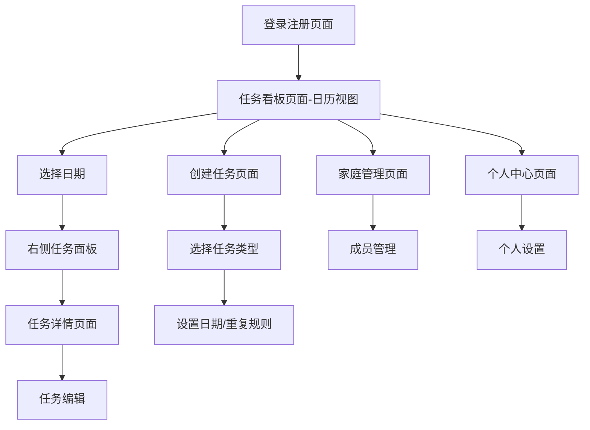

# 家庭任务管理系统 - 产品需求文档

## 1. 产品概述

家庭任务管理系统是一个专为家庭成员协作设计的任务管理平台，采用直观的日历视图帮助家庭成员更好地分工合作，提高家庭事务的执行效率。
- 解决家庭成员之间任务分配不明确、执行情况难以跟踪的问题，通过日历视图让每个家庭成员都能清楚看到日程安排和任务分布。
- 支持普通任务、长期任务和每日任务三种类型，满足不同场景的家庭协作需求，通过简单易用的界面和完整的任务追踪机制，提升家庭协作效率。

## 2. 核心功能

### 2.1 用户角色

| 角色 | 注册方式 | 核心权限 |
|------|----------|----------|
| 家庭成员 | 邮箱注册或邀请码加入 | 可创建任务、分配任务、完成任务、查看家庭所有任务 |
| 家庭管理员 | 创建家庭时自动成为管理员 | 拥有家庭成员的所有权限，另外可以邀请新成员、移除成员 |

### 2.2 功能模块

我们的家庭任务管理系统需求包含以下主要页面：

1. **登录注册页面**：用户登录、注册、加入家庭功能
2. **任务看板页面**：日历视图展示、日期选择、任务类型管理（普通任务、长期任务、每日任务）
3. **任务详情页面**：任务详细信息、编辑、状态更新
4. **创建任务页面**：新建任务、选择任务类型、分配责任人、设置重复规则
5. **家庭管理页面**：成员管理、邀请码生成、权限设置
6. **个人中心页面**：个人信息、任务统计、系统设置

### 2.3 页面详情

| 页面名称 | 模块名称 | 功能描述 |
|----------|----------|----------|
| 登录注册页面 | 用户认证 | 邮箱登录、注册新账户、通过邀请码加入家庭 |
| 任务看板页面 | 日历视图 | 月历显示，日期上显示任务数量标识，支持月份切换 |
| 任务看板页面 | 日期选择 | 点击日期显示当天任务列表，支持任务类型筛选（普通任务/长期任务/每日任务） |
| 任务看板页面 | 任务面板 | 右侧面板显示选中日期的任务详情，支持快速操作和状态切换 |
| 任务详情页面 | 任务信息 | 显示任务标题、描述、创建者、责任人、完成者、创建时间、完成时间 |
| 任务详情页面 | 任务编辑 | 修改任务信息、重新分配责任人、添加备注 |
| 创建任务页面 | 任务创建 | 输入任务标题、描述、选择责任人、设置优先级（高/中/低）、选择任务类型（普通任务/长期任务/每日任务）、设置截止日期或重复规则 |
| 家庭管理页面 | 成员管理 | 查看家庭成员列表、生成邀请码、移除成员（仅管理员） |
| 家庭管理页面 | 家庭设置 | 修改家庭名称、家庭描述 |
| 个人中心页面 | 个人信息 | 修改昵称、头像、邮箱 |
| 个人中心页面 | 任务统计 | 显示个人创建任务数、完成任务数、待完成任务数 |

## 3. 核心流程

**普通家庭成员流程：**
1. 用户通过邀请码注册并加入家庭
2. 进入任务看板的日历视图，查看当前日期的任务
3. 点击不同日期查看该日的任务安排
4. 通过任务类型筛选查看普通任务、长期任务或每日任务
5. 在右侧任务面板中查看任务详情并标记完成状态
6. 可以创建新任务并选择任务类型、设置截止日期或重复规则

**管理员流程：**
1. 创建家庭并获得管理员权限
2. 生成邀请码邀请家庭成员加入
3. 在日历视图中统览家庭任务分布情况
4. 管理家庭成员，分配和监督各类型任务执行
5. 查看家庭任务完成情况和统计数据

## 4. 用户界面设计

### 4.1 设计风格

- **主色调**：温暖的蓝色 (#4A90E2) 作为主色，温馨的橙色 (#F5A623) 作为辅助色
- **按钮样式**：圆角按钮设计，主要按钮采用渐变效果，次要按钮采用边框样式
- **字体**：主标题使用 18-24px，正文使用 14-16px，采用系统默认字体栈
- **布局风格**：卡片式布局，顶部导航栏，左侧可选菜单栏
- **图标风格**：使用简洁的线性图标，配合适当的彩色状态图标

### 4.2 页面设计概览

| 页面名称 | 模块名称 | UI元素 |
|----------|----------|--------|
| 登录注册页面 | 登录表单 | 居中卡片布局，蓝色渐变背景，白色输入框，圆角按钮 |
| 任务看板页面 | 日历组件 | 左侧月历视图，日期格子显示任务数量小圆点，当前日期高亮，选中日期用主色调标识 |
| 任务看板页面 | 任务面板 | 右侧任务列表面板，按任务类型分组显示，支持折叠展开，任务项显示标题、责任人头像、优先级标识 |
| 任务看板页面 | 类型筛选 | 顶部任务类型切换标签（普通任务/长期任务/每日任务），不同类型用不同颜色标识 |
| 任务详情页面 | 详情展示 | 大卡片布局，信息分区显示，时间轴展示任务历史 |
| 创建任务页面 | 表单输入 | 垂直表单布局，标签清晰，下拉选择器，日期选择器 |
| 家庭管理页面 | 成员列表 | 列表布局，头像+姓名+角色，操作按钮右对齐 |
| 个人中心页面 | 统计图表 | 简单的饼图或柱状图，数字突出显示 |

### 4.3 响应式设计

系统采用移动优先的响应式设计，支持桌面端和移动端访问，针对触屏设备优化交互体验，按钮和点击区域适当放大。