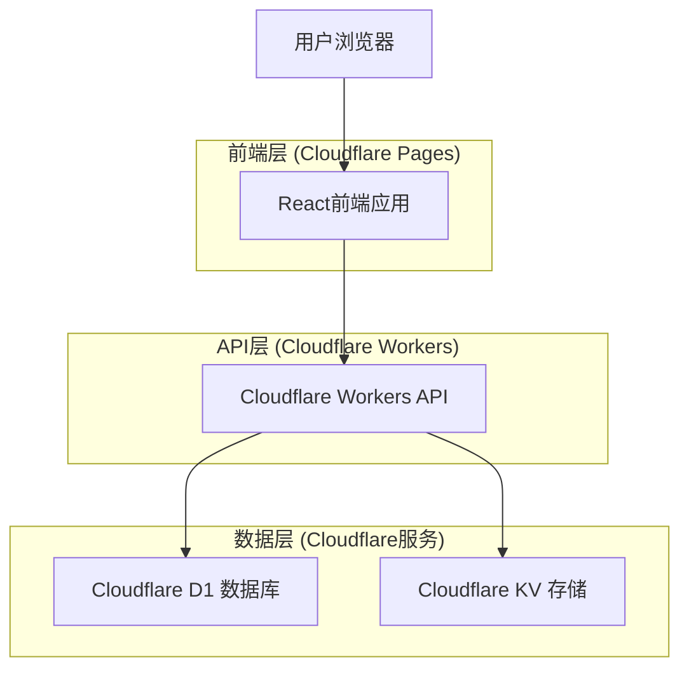
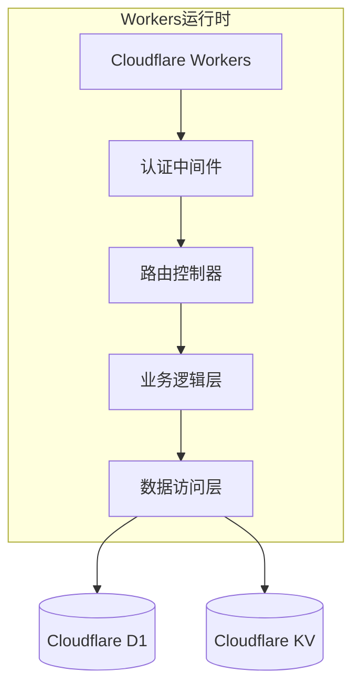
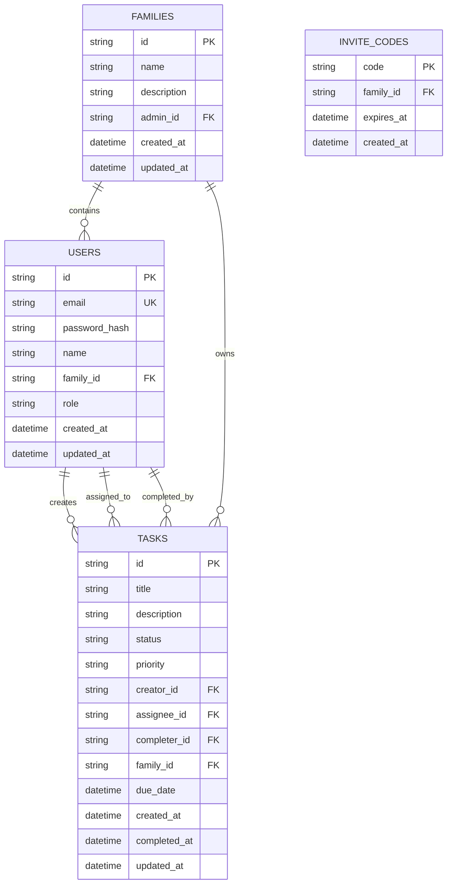

# 家庭任务管理系统 - 技术架构文档

## 1. 架构设计



## 2. 技术描述

- 前端：React@18 + TypeScript + Tailwind CSS + Vite
- 后端：Cloudflare Workers + Hono框架
- 数据库：Cloudflare D1 (SQLite)
- 缓存存储：Cloudflare KV
- 认证：基于JWT的自定义认证系统
- 部署：Cloudflare Pages + Cloudflare Workers

## 3. 路由定义

| 路由 | 用途 |
|------|------|
| / | 首页，未登录时显示登录界面，已登录时重定向到任务看板 |
| /login | 登录页面，用户认证 |
| /register | 注册页面，新用户注册 |
| /join/:inviteCode | 通过邀请码加入家庭 |
| /dashboard | 任务看板页面，显示所有任务和筛选功能 |
| /task/:id | 任务详情页面，显示和编辑任务信息 |
| /task/create | 创建任务页面，新建任务表单 |
| /family | 家庭管理页面，成员管理和家庭设置 |
| /profile | 个人中心页面，个人信息和统计 |

## 4. API定义

### 4.1 核心API

**用户认证相关**
```
POST /api/auth/register
```

请求参数：
| 参数名 | 参数类型 | 是否必需 | 描述 |
|--------|----------|----------|------|
| email | string | true | 用户邮箱 |
| password | string | true | 用户密码 |
| name | string | true | 用户姓名 |
| familyName | string | false | 家庭名称（创建新家庭时） |
| inviteCode | string | false | 邀请码（加入现有家庭时） |

响应参数：
| 参数名 | 参数类型 | 描述 |
|--------|----------|------|
| success | boolean | 注册是否成功 |
| token | string | JWT认证令牌 |
| user | object | 用户信息 |

```
POST /api/auth/login
```

请求参数：
| 参数名 | 参数类型 | 是否必需 | 描述 |
|--------|----------|----------|------|
| email | string | true | 用户邮箱 |
| password | string | true | 用户密码 |

**任务管理相关**
```
GET /api/tasks
```

查询参数：
| 参数名 | 参数类型 | 是否必需 | 描述 |
|--------|----------|----------|------|
| status | string | false | 任务状态筛选 |
| assignee | string | false | 责任人筛选 |
| priority | string | false | 优先级筛选 |

```
POST /api/tasks
```

请求参数：
| 参数名 | 参数类型 | 是否必需 | 描述 |
|--------|----------|----------|------|
| title | string | true | 任务标题 |
| description | string | false | 任务描述 |
| assigneeId | string | true | 责任人ID |
| priority | string | true | 优先级（high/medium/low） |
| dueDate | string | false | 截止日期 |

```
PUT /api/tasks/:id/complete
```

**家庭管理相关**
```
GET /api/family/members
```

```
POST /api/family/invite
```

请求参数：
| 参数名 | 参数类型 | 是否必需 | 描述 |
|--------|----------|----------|------|
| expiresIn | number | false | 邀请码有效期（小时） |

## 5. 服务器架构图



## 6. 数据模型

### 6.1 数据模型定义



### 6.2 数据定义语言

**用户表 (users)**
```sql
-- 创建用户表
CREATE TABLE users (
    id TEXT PRIMARY KEY DEFAULT (lower(hex(randomblob(16)))),
    email TEXT UNIQUE NOT NULL,
    password_hash TEXT NOT NULL,
    name TEXT NOT NULL,
    family_id TEXT,
    role TEXT DEFAULT 'member' CHECK (role IN ('admin', 'member')),
    created_at DATETIME DEFAULT CURRENT_TIMESTAMP,
    updated_at DATETIME DEFAULT CURRENT_TIMESTAMP,
    FOREIGN KEY (family_id) REFERENCES families(id)
);

-- 创建索引
CREATE INDEX idx_users_email ON users(email);
CREATE INDEX idx_users_family_id ON users(family_id);
```

**家庭表 (families)**
```sql
-- 创建家庭表
CREATE TABLE families (
    id TEXT PRIMARY KEY DEFAULT (lower(hex(randomblob(16)))),
    name TEXT NOT NULL,
    description TEXT,
    admin_id TEXT NOT NULL,
    created_at DATETIME DEFAULT CURRENT_TIMESTAMP,
    updated_at DATETIME DEFAULT CURRENT_TIMESTAMP,
    FOREIGN KEY (admin_id) REFERENCES users(id)
);
```

**任务表 (tasks)**
```sql
-- 创建任务表
CREATE TABLE tasks (
    id TEXT PRIMARY KEY DEFAULT (lower(hex(randomblob(16)))),
    title TEXT NOT NULL,
    description TEXT,
    status TEXT DEFAULT 'pending' CHECK (status IN ('pending', 'in_progress', 'completed')),
    priority TEXT DEFAULT 'medium' CHECK (priority IN ('high', 'medium', 'low')),
    creator_id TEXT NOT NULL,
    assignee_id TEXT NOT NULL,
    completer_id TEXT,
    family_id TEXT NOT NULL,
    due_date DATETIME,
    created_at DATETIME DEFAULT CURRENT_TIMESTAMP,
    completed_at DATETIME,
    updated_at DATETIME DEFAULT CURRENT_TIMESTAMP,
    FOREIGN KEY (creator_id) REFERENCES users(id),
    FOREIGN KEY (assignee_id) REFERENCES users(id),
    FOREIGN KEY (completer_id) REFERENCES users(id),
    FOREIGN KEY (family_id) REFERENCES families(id)
);

-- 创建索引
CREATE INDEX idx_tasks_family_id ON tasks(family_id);
CREATE INDEX idx_tasks_assignee_id ON tasks(assignee_id);
CREATE INDEX idx_tasks_status ON tasks(status);
CREATE INDEX idx_tasks_created_at ON tasks(created_at DESC);
```

**邀请码表 (invite_codes)**
```sql
-- 创建邀请码表
CREATE TABLE invite_codes (
    code TEXT PRIMARY KEY,
    family_id TEXT NOT NULL,
    expires_at DATETIME NOT NULL,
    created_at DATETIME DEFAULT CURRENT_TIMESTAMP,
    FOREIGN KEY (family_id) REFERENCES families(id)
);

-- 创建索引
CREATE INDEX idx_invite_codes_expires_at ON invite_codes(expires_at);
```

**初始化数据**
```sql
-- 创建示例家庭
INSERT INTO families (id, name, description, admin_id) 
VALUES ('family_demo_001', '示例家庭', '这是一个示例家庭', 'user_demo_001');

-- 创建示例用户
INSERT INTO users (id, email, password_hash, name, family_id, role)
VALUES 
('user_demo_001', 'admin@example.com', '$2b$10$example_hash', '家庭管理员', 'family_demo_001', 'admin'),
('user_demo_002', 'member@example.com', '$2b$10$example_hash', '家庭成员', 'family_demo_001', 'member');

-- 创建示例任务
INSERT INTO tasks (title, description, creator_id, assignee_id, family_id, priority)
VALUES 
('打扫客厅', '周末大扫除，清理客厅卫生', 'user_demo_001', 'user_demo_002', 'family_demo_001', 'medium'),
('买菜', '购买本周所需的蔬菜和肉类', 'user_demo_002', 'user_demo_001', 'family_demo_001', 'high');
```